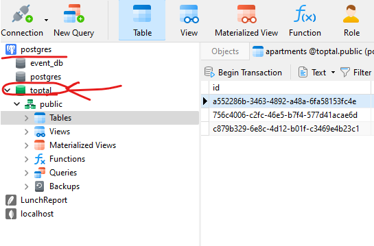

# Toptal Apartment Rental App Backend Part (Express.js & PostgreSQL)

## Installation
1. Clone the repo

```bash
git clone https://git.toptal.com/screening-ops/Dias-ishbulatov.git
cd backend
```
2. Install the dependencies

```bash
npm install
```

3. Install Nodemon

```bash
npm install -g nodemon
```


## Pre-requisite
### 1. A running PostgreSQL Server
You have to download and install PostgreSQL.

`https://www.enterprisedb.com/downloads/postgres-postgresql-downloads`

You can change the Postgres User and Password configuration on the "orm/dataSource.ts" file like below.

#### e.g.
```
User = postgres
Password = 123
...
```

### 2. An empty DB on the PostgreSQL

Create new Database on PostgreSQL ("toptal")

You can use this Command
```
CREATE DATABASE "toptal";
```
Or use DB management application (Navicat, etc).





### 3. A running Node.js Server
#### `node` and `npm` installed


## Getting Started
Here is what you need to get it up and running:

#### A free `3001` PORT (you may change the port in `.env`)


## How to run
You are now ready to start the API Server.

```bash
npm start
```
