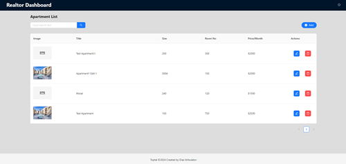
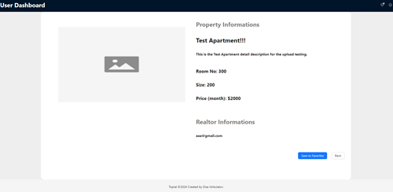
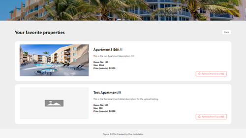

# Toptal Apartment Rental App Frontend Part (React.js/Redux/TypeScript)

This project was bootstrapped with [Create React App](https://github.com/facebook/create-react-app).

## Installation
1. Clone the repo

```bash
git clone https://git.toptal.com/screening-ops/Dias-ishbulatov.git
cd frontend
```
2. Install the dependencies

```bash
npm install
```


## Getting Started


### `npm start`

Runs the app in the development mode.\
Open [http://localhost:3000](http://localhost:3000) to view it in the browser.

The page will reload if you make edits.\
You will also see any lint errors in the console.


## Pages

### AuthPage


### Realtor Dashboard



### Realtor New Apartment


### Regular User Dashboard


### Regular User Property Detail



### Regular User Favorites

